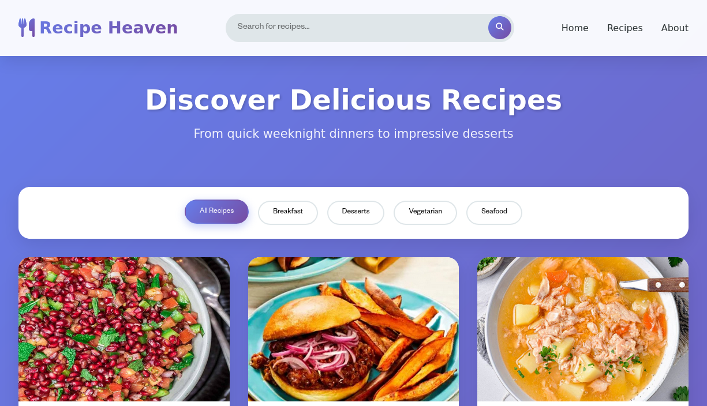
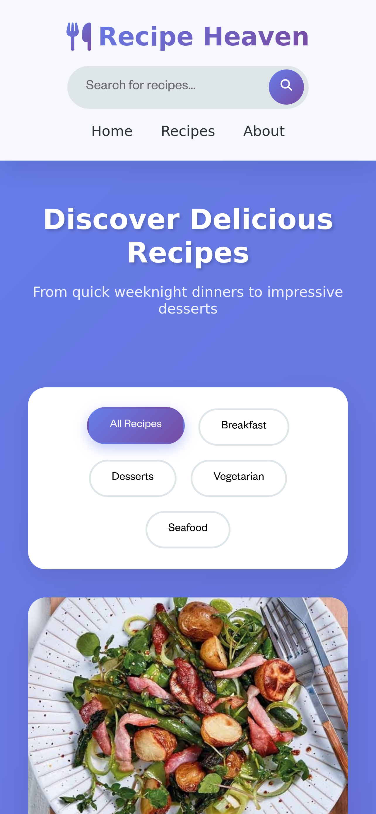

# Assignment-4

### Name : Gouranga Das Samrat

### Email: gouranga.das.khulna@gmail.com

[ Live url](https://recipe-heaven-me.netlify.app)

---

---

# 🍽️ Recipe Heaven

<div align="center">


**A modern, lightweight recipe discovery app built with pure HTML, CSS, and JavaScript**

[](https://recipe-heaven-me.netlify.app)
[](https://stackblitz.com/github.com/GourangaDasSamrat/Recipe-Heaven)
[](https://deepwiki.com/GourangaDasSamrat/Recipe-Heaven)

[](LICENSE)

[Features](#-features) • [Demo](#-demo) • [Installation](#-installation) • [Usage](#-usage) • [Tech-Stack](#️-tech-stack) • [Contributing](#-contributing)

</div>

---

## 🌟 Overview

**Recipe Heaven** is a modern recipe discovery application that allows users to explore, search, and view detailed cooking recipes with a visually rich and smooth user experience.

The app consumes data from **TheMealDB API** and focuses on performance, clean UI, and zero framework dependency—everything is built using **vanilla HTML, CSS, and JavaScript**.

### 🎯 Why Recipe Heaven?

- ⚡ Lightweight and fast (no frameworks)
- 🎨 Beautiful modern UI with custom animations
- 🍕 Real-world API integration
- 📄 Download recipes as PDF
- 📱 Fully responsive design

---

## ✨ Features

- 🔍 Search recipes by name
- 🎲 Random recipe discovery
- 🏷️ Category filtering (Breakfast, Dessert, Vegetarian, Seafood)
- 📋 Detailed recipe modal
  - Cooking instructions
  - Ingredients with measurements
  - YouTube video link (if available)
  - Original source link
- 📄 Download recipe as PDF
- ⏳ Preloader animation
- ⌨️ Keyboard support (ESC to close modal)
- 📱 Mobile-first responsive layout

---

## 🚀 Demo

### Live Application

🌐 https://recipe-heaven-me.netlify.app

### Try it Online

💻 https://stackblitz.com/github.com/GourangaDasSamrat/Recipe-Heaven

### Documentation

📚 https://deepwiki.com/GourangaDasSamrat/Recipe-Heaven

---

## 📸 Screenshots

### Desktop View



### Mobile View



---

## 🛠️ Tech Stack

| Technology        | Purpose                             |
| ----------------- | ----------------------------------- |
| HTML5             | Application structure               |
| CSS3              | Styling & animations (No libraries) |
| JavaScript (ES6+) | API fetching & interactivity        |
| TheMealDB API     | Recipe data                         |
| html2pdf.js       | PDF generation                      |
| Font Awesome      | Icons                               |

---

## 📦 Installation

### Clone the Repository

```bash
git clone https://github.com/GourangaDasSamrat/Recipe-Heaven
cd Recipe-Heaven
```

### Run Localy

```bash
# Linux / macOS
python3 -m http.server 8000

# Windows
python -m http.server 8000
```

Open your browser at:

```bash
http://localhost:8000
```

---

## 🎨 UI & CSS Highlights

- Fully custom UI (no CSS frameworks)
- CSS variables for theme consistency
- Keyframe-based animations
- Responsive design using media queries

---

## 🧠 API Endpoints Used

- Random recipe

```
https://www.themealdb.com/api/json/v1/1/random.php
```

- Search recipe

```
https://www.themealdb.com/api/json/v1/1/search.php?s=QUERY
```

- Filter by category
- ~

```
https://www.themealdb.com/api/json/v1/1/filter.php?c=CATEGORY
```

---

## 🤝 Contributing

Contributions are welcome!

1. Fork the repository
   `
2. Create a new branch (`git checkout -b feature/YourFeature`)

3. Commit changes (`git commit -m "Add new feature"`)

4. Push to branch (`git push origin feature/YourFeature`)

5. Open a Pull Request

### Contribution Ideas

- Bug fixes
- New features
- UI/UX improvements
- Accessibility improvements

---

# 🐛 Bug Reports

When reporting bugs, please include:

- Description of the issue
- Steps to reproduce
- Expected vs actual behavior
- Browser & OS information
- Screenshots (if applicable)

---

## 💡 Feature Requests

Have an idea? We'd love to hear it! Open an issue with:

- Clear description of the feature
- Use case and benefits
- Possible implementation approach

---

## 📄 License

This project is licensed under the **MIT License** - see the [LICENSE](LICENSE) file for details.

---

## 👨‍💻 Author

**Gouranga Das Samrat**

- GitHub: [@GourangaDasSamrat](https://github.com/GourangaDasSamrat)
- Project Link: [Note Flow App](https://github.com/GourangaDasSamrat/Recipe-Heaven)

---

## 📊 Project Status


---

## 🌟 Star History

If you find this project useful, please consider giving it a ⭐ on GitHub!

---

## 📞 Support

Need help? Have questions?

- 📧 Open an issue on GitHub
- 💬 Start a discussion
- 📚 Check the [documentation](https://deepwiki.com/GourangaDasSamrat/Recipe-Heaven)

---

<div align="center">

**Made with ❤️ and lots of 🍕**

[⬆ Back to Top](#-Recipe-Heaven)
